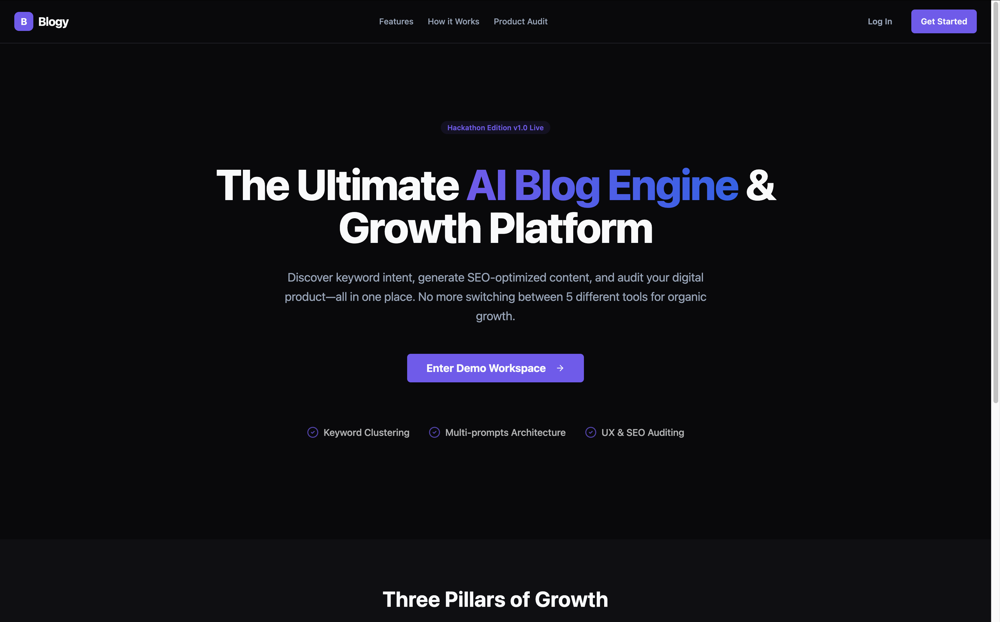
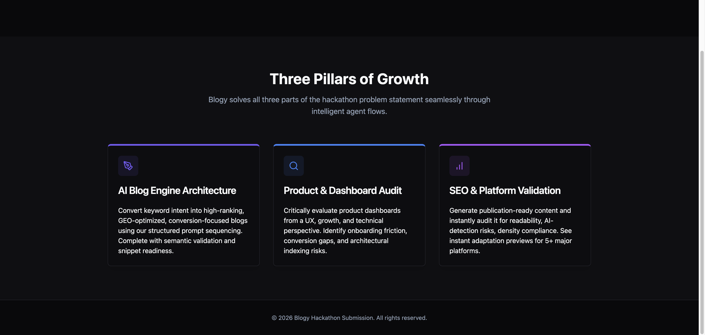
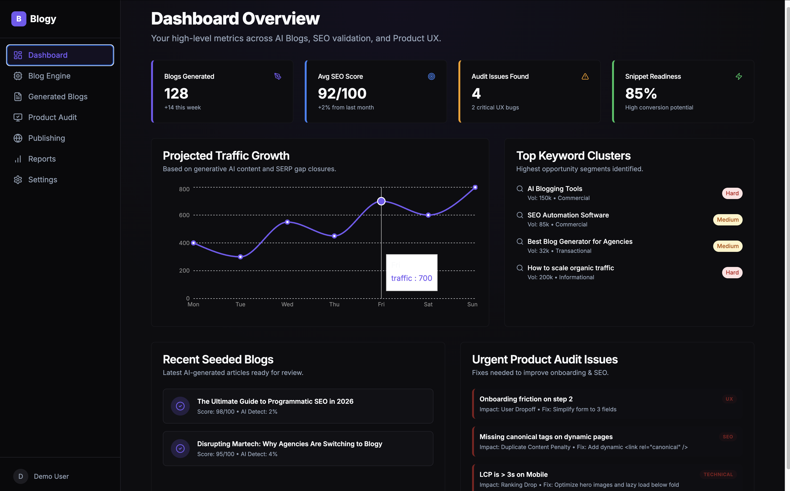
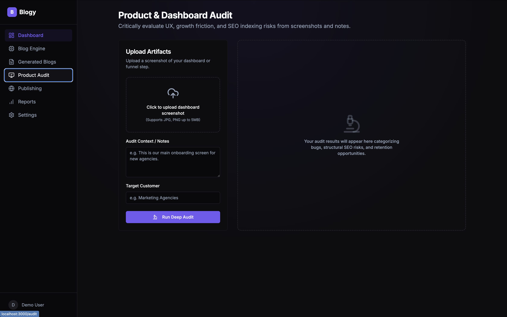
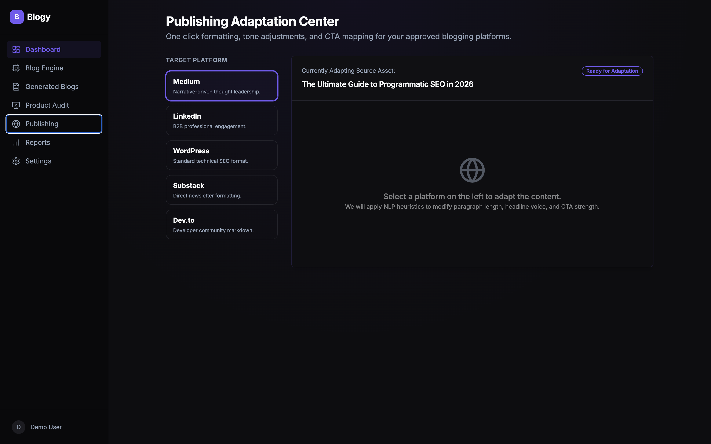
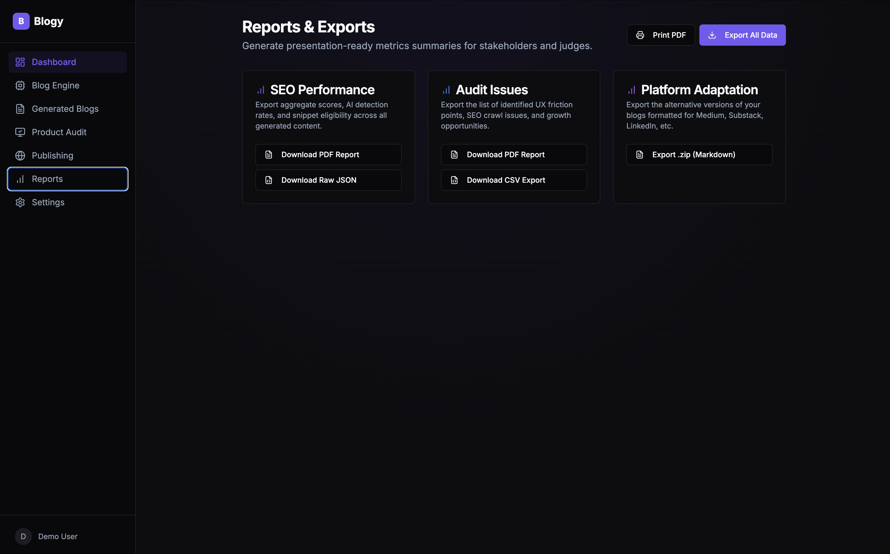

Blogy – AI Blog Engine & Growth Audit Platform

Blogy is a high-performance AI-powered content growth platform built to solve the complete blogging workflow in one place.

It combines:

* AI Blog Generation
* SEO Validation
* Product & Dashboard Auditing
* Multi-Platform Publishing
* Reports & Export System

Instead of using separate tools for keyword research, blog writing, SEO analysis, dashboard review, and content publishing, Blogy brings everything together into one smart workspace.

⸻

Features

AI Blog Engine

Generate SEO-optimized blogs from keywords, topics, or product information.

* Keyword clustering
* Blog structure generation
* SEO scoring
* Readability validation
* AI detection analysis
* Snippet readiness

Product & Dashboard Audit

Analyze dashboard screenshots and product flows to identify:

* UX friction points
* Onboarding issues
* SEO crawl risks
* Canonical tag problems
* Mobile performance bottlenecks
* Growth and retention gaps

Multi-Platform Publishing

Instantly adapt generated blogs for different platforms:

* Medium
* LinkedIn
* WordPress
* Dev.to
* Substack

Reports & Export System

Export all generated insights into:

* PDF Reports
* CSV Exports
* JSON Files
* Markdown / ZIP Bundles

⸻

Tech Stack

Frontend

* Next.js 14
* React
* TypeScript
* Tailwind CSS
* shadcn/ui
* Lucide React Icons
* Recharts

Backend / Logic Layer

* Mock AI Data Layer
* SEO Validation Engine
* Deterministic Scoring System
* Export & Reporting Logic

⸻

Project Structure

BLOGGY/
├── src/
├── Screenshots/
├── README.md
├── package.json
├── tailwind.config.js
├── tsconfig.json
├── postcss.config.js
├── ARCHITECTURE.md
├── DEMO_SCRIPT.md
├── SCORING.md
└── TECH_WALKTHROUGH.md

⸻

Installation & Setup

Make sure Node.js 18+ is installed.

npm install
npm run dev

Then open:

http://localhost:3000

⸻

Main Routes

Route	Description
/	Landing Page
/dashboard	Main Dashboard
/engine	AI Blog Engine
/blogs	Generated Blogs
/audit	Product & Dashboard Audit
/publish	Multi-Platform Publishing
/reports	Reports & Export Section

⸻
Screenshots: 

_____
Why Blogy?

Most AI content tools only generate text.

Blogy goes beyond generation by combining:

* Content creation
* SEO validation
* Product auditing
* Multi-platform adaptation
* Exportable reports

This makes Blogy useful for:

* Startups
* Agencies
* SEO teams
* Product managers
* Content creators
* Marketing teams

⸻

Future Scope

* Real AI API integration
* SERP competitor analysis
* Auto-publishing to CMS platforms
* Real-time keyword difficulty analysis
* Team collaboration tools
* AI-generated thumbnails and creatives
* Analytics dashboard with live traffic tracking

⸻

Hackathon Readiness

To ensure a stable live demo experience:

* Graceful fallback handling is implemented
* Mocked deterministic data is used
* No dependency on paid APIs during judging
* Exportable reports are available instantly
* Every workflow can be demonstrated live

⸻

Author

Developed by Adeesh Agrawal

⸻

License

This project is built for hackathon and educational purposes.